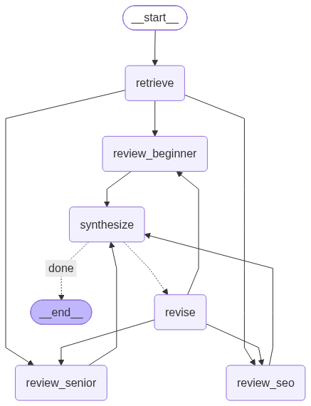

# 블로그 글 리뷰어

새 블로그 글 초안을 넣으면, 내 기존 블로그 글을 RAG로 참고해서 세 명의 페르소나가 각자 관점으로 리뷰하고, 그 결과를 종합해 점수와 수정안을 내놓는 도구입니다.

## 프로젝트 소개

글을 발행하기 전에 "처음 보는 사람이 이해할까", "틀린 내용은 없을까", "검색에 걸릴까"를 혼자 점검하기는 어렵습니다. 이 프로젝트는 그 세 가지 질문을 각각 맡는 리뷰어를 두고, 내 블로그에 이미 쌓인 글을 근거로 리뷰하게 합니다.

- **내 블로그를 아는 리뷰**: 기존 글 258편을 벡터 DB에 넣어 두고, 초안과 관련된 글을 찾아 리뷰어에게 함께 줍니다. 그래서 "이 내용은 예전 글과 이어지니 링크하라", "평소 글과 말투가 다르다" 같은 의견이 나옵니다.
- **세 가지 관점**: 페르소나마다 보는 것이 다르고, 서로의 영역은 건드리지 않습니다.
  - 초보 독자: 이해 안 되는 용어, 건너뛴 설명, 따라 하다 막힐 지점
  - 시니어 개발자: 기술적 정확성, 빠진 예외 상황, 더 나은 구현 방식
  - SEO 전문가: 제목, 소제목 구조, 키워드, 도입부의 검색 노출
- **종합과 우선순위**: 세 리뷰를 하나로 합쳐 높음·중간·낮음 순서의 수정 사항으로 정리합니다.
- **수정안 자동 작성**: 평균 점수가 기준(기본 7점)에 못 미치면 수정안을 쓰고 다시 리뷰합니다. 최대 2회 반복합니다.
- **결과 보관**: 리뷰 과정이 PostgreSQL에 체크포인트로 남아, 나중에 같은 주소로 다시 열어 볼 수 있습니다.

## 흐름



| 노드 | 하는 일 |
|---|---|
| `retrieve` | 초안과 관련된 기존 글을 PGVector에서 찾습니다. |
| `review_beginner`, `review_senior`, `review_seo` | 세 페르소나가 기존 글을 근거로 동시에 리뷰합니다. 각자 점수(1~10), 좋은 점, 고칠 점을 냅니다. |
| `synthesize` | 평균 점수를 계산하고, 세 리뷰를 우선순위별 수정 사항으로 정리합니다. |
| `revise` | 평균이 기준 미만이면 수정안을 쓰고 리뷰 단계로 돌아갑니다. |

## 기술 스택

| 역할 | 사용한 것 | 버전 |
|---|---|---|
| 언어 | Python | 3.12 |
| 워크플로우 | LangGraph | 1.2.14 |
| 체크포인터 | langgraph-checkpoint-postgres (PostgresSaver) | 3.1.2 |
| 문서 분할·검색 | LangChain, langchain-text-splitters | 1.4.3, 1.1.3 |
| 벡터 저장소 | PostgreSQL 16 + pgvector, langchain-postgres (PGVector) | 0.0.19 |
| LLM | Claude `claude-opus-5-5`, langchain-anthropic | 1.7.5 |
| 임베딩 | `BAAI/bge-m3` (로컬 실행, 1024차원), langchain-huggingface | 1.2.2 |
| 수집 | requests, BeautifulSoup | 2.34.2, 4.15.0 |
| 화면 | Streamlit | 1.65.0 |

고른 이유는 다음과 같습니다.

- **pgvector**: 벡터 저장소와 체크포인터를 PostgreSQL 하나로 해결합니다. 따로 벡터 DB를 띄우지 않습니다.
- **bge-m3**: 무료로 로컬에서 돌고, 한국어 글을 영어 질문으로도 찾을 만큼 다국어 성능이 좋습니다. 대신 GPU가 없으면 적재가 느립니다.
- **LangGraph**: 병렬 리뷰, 조건 분기, 반복이 그래프 구조로 그대로 드러납니다.
- **구조화 출력**: 리뷰와 종합 결과는 Pydantic 모델로 받아, 점수 계산과 화면 표시에 그대로 씁니다.

## 파일 구조

```
blog-reviewer/
├─ config.py          # .env 로딩, DB URL, LLM·임베딩·벡터 저장소 생성, 기준 점수 등 설정
├─ check_db.py        # DB 연결 확인
├─ ingest.py          # 블로그 글 수집 → 분할 → 임베딩 → PGVector 적재
├─ search_test.py     # 검색 테스트
├─ retriever.py       # 초안과 관련된 기존 글 검색 (글 단위로 묶기)
├─ reviewer.py        # Review 스키마, 페르소나 한 명의 리뷰
├─ editor.py          # 리뷰 종합, 수정안 생성
├─ graph.py           # LangGraph 워크플로우
├─ app.py             # Streamlit 화면
├─ prompts/
│  ├─ common.md       # 모든 리뷰어 공통: 리뷰 방식, 점수 기준
│  ├─ beginner.md     # 초보 독자
│  ├─ senior.md       # 시니어 개발자
│  ├─ seo.md          # SEO 전문가
│  ├─ synthesize.md   # 종합(편집장)
│  └─ revise.md       # 수정안 작성
├─ samples/           # 테스트용 초안과 그 수정안
└─ docs/graph.png     # 그래프 구조 이미지
```

파일은 만든 순서대로 읽으면 됩니다: `config` → `ingest` → `retriever` → `reviewer` → `editor` → `graph` → `app`.

## 준비

### 1. PostgreSQL + pgvector

pgvector가 설치된 PostgreSQL이 필요합니다. 이 프로젝트는 `pgvector/pgvector:pg16` 이미지를 씁니다.
DB에 스키마와 확장을 한 번 만들어 둡니다.

```sql
CREATE SCHEMA IF NOT EXISTS blog_reviewer;
CREATE EXTENSION IF NOT EXISTS vector;
```

모든 테이블은 `blog_reviewer` 스키마 안에 만들어집니다. 코드에는 스키마 이름을 적지 않고, 연결 문자열의 `search_path`로 지정합니다.

### 2. 패키지 설치

Python 3.12 기준입니다.

```bash
python -m venv .venv
.venv\Scripts\activate
pip install -r requirements.txt
```

### 3. 환경 변수

`.env.example`을 `.env`로 복사하고 값을 채웁니다.

| 키 | 설명 |
|---|---|
| `DATABASE_URL` | `postgresql+psycopg://` 형식. 끝에 `?options=-csearch_path%3Dblog_reviewer,public`을 붙입니다. |
| `ANTHROPIC_API_KEY` | Claude API 키 |

### 4. 블로그 주소

`config.py`의 `BLOG_URL`을 자기 블로그 주소로 바꿉니다. 수집기는 티스토리 기준입니다(아래 "다른 블로그에 쓰려면" 참고).

## 실행

### 1. DB 연결 확인

```bash
python check_db.py
```

스키마, `vector` 확장, 테이블 생성 권한을 확인하고 `OK`를 출력합니다.

### 2. 블로그 글 적재

임베딩 모델(약 2GB)을 처음 받을 때만 오프라인 설정을 끄고 실행합니다.

```powershell
$env:HF_HUB_OFFLINE = "0"
python ingest.py
```

그다음부터는 그냥 실행하면 됩니다.

```bash
python ingest.py            # data/posts.json이 있으면 재사용
python ingest.py --refresh  # 블로그에서 다시 수집
```

- 수집 원본은 `data/posts.json`에 저장됩니다.
- 적재는 매번 컬렉션을 비우고 전체를 다시 넣습니다. 이어서 하기는 되지 않습니다.
- GPU가 없으면 오래 걸립니다. 글 258편(청크 3,037개)에 CPU로 약 50분 걸렸습니다.

### 3. 검색 테스트

```bash
python search_test.py
python search_test.py "JPA N+1 문제"
```

출력되는 숫자는 코사인 거리라서 낮을수록 가깝습니다.

### 4. 리뷰 실행

화면으로 실행합니다.

```bash
streamlit run app.py
```

터미널에서 실행할 수도 있습니다.

```bash
python reviewer.py                    # 세 페르소나 리뷰만 (종합·수정 없음)
python reviewer.py 내초안.md senior    # 파일과 페르소나 지정
python graph.py 내초안.md              # 전체 워크플로우. 수정안은 내초안.revised.md로 저장
python graph.py --image               # docs/graph.png 다시 만들기 (인터넷 필요)
```

리뷰 한 번에 1~2분, 수정이 2회 반복되면 7~8분 걸립니다.

## 화면 사용법

1. 초안을 마크다운으로 붙여 넣고 **리뷰 시작**을 누릅니다.
2. 진행 상황이 노드 단위로 표시됩니다.
3. 끝나면 원본 평균과 최종 평균, 수정 횟수가 나옵니다.
4. **라운드**에서 원본, 1차 수정, 2차 수정을 골라 그때의 리뷰, 종합 결과, 글을 봅니다.
5. 수정안은 미리보기로 확인하고 마크다운으로 내려받습니다.

리뷰가 끝나면 주소에 `?thread=<id>`가 붙습니다. 이 주소로 다시 들어오면 체크포인트에 저장된 결과를 그대로 불러옵니다.

수정안의 `[확인 필요: …]` 표시는 측정값이나 실행 환경처럼 글쓴이만 아는 내용을 채울 자리입니다. LLM이 지어내지 않도록 비워 둔 것입니다.

## 설정 바꾸기

`config.py`에서 바꿉니다.

| 설정 | 기본값 | 설명 |
|---|---|---|
| `LLM_MODEL` | `claude-opus-5-5` | `claude-sonnet-5-5`로 바꾸면 비용이 절반입니다. |
| `PASS_SCORE` | `7.0` | 평균이 이 값 미만이면 수정합니다. 화면 사이드바에서도 바꿀 수 있습니다. |
| `MAX_REVISIONS` | `2` | 수정 → 재리뷰 반복 횟수 상한 |
| `REVISION_MAX_RATIO` | `2.0` | 수정안 분량 상한. 원본 글자 수의 몇 배까지 허용할지 |
| `REVISION_MIN_CHARS` | `3000` | 짧은 초안에도 허용하는 수정안 최소 상한(글자 수) |
| `EMBEDDING_MODEL` | `BAAI/bge-m3` | 바꾸면 `EMBEDDING_DIM`도 맞추고 다시 적재해야 합니다. |

검색 범위는 `retriever.py`(거리 기준 `MAX_DISTANCE`, 근거로 쓸 글 수 `MAX_POSTS`), 청크 크기는 `ingest.py`(`CHUNK_SIZE`)에 있습니다.

리뷰어의 관점이나 점수 기준을 바꾸려면 `prompts/`의 마크다운 파일을 고칩니다. 코드를 건드릴 필요가 없습니다.

## 다른 블로그에 쓰려면

`ingest.py`의 수집 부분만 바꾸면 됩니다.

- `fetch_post_urls()`: `sitemap.xml`에서 글 URL을 고릅니다.
- `fetch_post()`: 제목(`og:title`), 작성일(`article:published_time`), 카테고리(`.category`), 본문(`.contents_style`)을 읽습니다. 카테고리와 본문의 선택자는 티스토리 스킨에 따라 다를 수 있습니다.

`collect()`가 `title`, `url`, `published_at`, `category`, `content`를 가진 글 목록을 돌려주기만 하면 나머지는 그대로 동작합니다.

## 알아둘 점

- **수정안 분량에는 상한이 있습니다.** 리뷰어가 요구하는 설명을 다 받아 적으면 글이 크게 불어나서(상한이 없을 때 663자 초안이 12,000자 이상), 원본의 2배(최소 3,000자)를 넘기지 않도록 요청합니다. 프롬프트로 요청하는 방식이라 정확히 보장되지는 않습니다. 이 상한은 추가한 뒤 실제 실행으로 검증하지 않았습니다.
- **비용이 듭니다.** 수정이 2회 반복되면 LLM을 14번(리뷰 9, 종합 3, 수정 2) 호출합니다. `claude-opus-5-5` 기준으로 한 번의 전체 실행에 1.5~2.5달러쯤 든다고 어림합니다(측정값이 아닌 추정). 줄이려면 `LLM_MODEL`을 `claude-sonnet-5-5`로 바꾸거나 `MAX_REVISIONS`를 낮춥니다.
- **점수는 실행마다 조금씩 다릅니다.** 같은 초안도 1점 안팎으로 흔들립니다.
- **비공개·보호 글은 수집되지 않습니다.**
- **`.env`와 `data/`는 커밋하지 않습니다.** `.gitignore`에 들어 있습니다.
